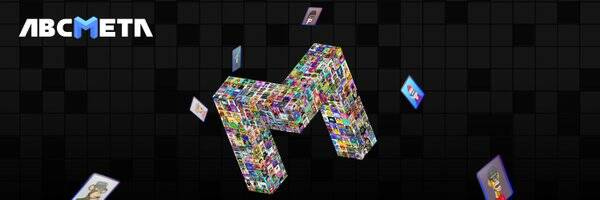

# NV-META-PASS

NV-META-PASS NFT 在过去 7 天内售出 2 次。NV-META-PASS 的总销售额为 9.55 美元。一份 NV-META-PASS NFT 的平均价格为 4.8 美元。共有 5,995 名 NV-META-PASS 所有者，总共拥有 1 个代币。

ABCMETA-PASS是空投接收的Ticket。您可以在www.abcmeta.io/airdrop上领取空投](https://abcmeta.io/airdrop)

ABCMETA.io是一个NFT资产铸造和交易的全球平台，项目提供“Bid-to-Earn”拍卖模式，是进入元界的全新入口。

参与“USDA流动性挖矿”的参与者将获得USDT奖励。

参与者还将获得 10 个免费铸币厂 ABCMETA-ID（一种像素化的 NFT），并享受永久版税。

只需伸出手进入 ABCMETA。

NV-META-PASS NFT - 常见问题（FAQ）
▶ 什么是 NV-META-PASS？
NV-META-PASS 是一个 NFT（Non-fungible token）集合。存储在区块链上的数字艺术品集合。
▶ 有多少个 NV-META-PASS 代币？
总共有 1 个 NV-META-PASS NFT。目前 5,995 位所有者的钱包中至少有一个 NV-META-PASS NTF。
▶ 最昂贵的 NV-META-PASS 销售是什么？
售出的最昂贵的 NV-META-PASS NFT 是 AIRDROP-PASS（价值高达 5,000 USDT）。它于 2022-06-29（大约 2 个月前）以 4.8 美元的价格售出。
▶ 最近卖出了多少 NV-META-PASS？
过去 30 天内售出了 2 个 NV-META-PASS NFT。

