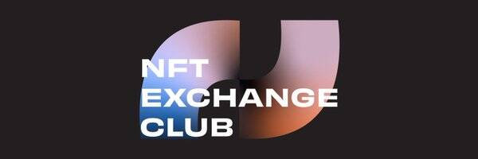

# NXC Sentiment API Alpha

NXC Sentiment API Alpha NFT 在过去 7 天内售出 7 次。NXC Sentiment API Alpha 的总销售额为 949.6 美元。一份 NXC Sentiment API Alpha NFT 的平均价格为 135.7 美元。共有 144 位 NXC Sentiment API Alpha 所有者，总共拥有 200 个代币。

NXC Sentiment API Alpha NFT - 常见问题（FAQ）
▶ 什么是 NXC 情绪 API Alpha？
NXC Sentiment API Alpha 是一个 NFT（不可替代令牌）集合。存储在区块链上的数字艺术品集合。
▶ 存在多少 NXC Sentiment API Alpha 代币？
总共有 200 个 NXC Sentiment API Alpha NFT。目前，144 位所有者的钱包中至少有一个 NXC Sentiment API Alpha NTF。
▶ 最昂贵的 NXC Sentiment API Alpha 销售是什么？
出售的最昂贵的 NXC Sentiment API Alpha NFT 是 Pass #135。它于 2022 年 6 月 25 日（2 个月前）以 219.6 美元的价格售出。
▶ 最近卖出了多少 NXC Sentiment API Alpha？
过去 30 天内售出了 12 个 NXC Sentiment API Alpha NFT。
▶ NXC Sentiment API Alpha 的成本是多少？
过去 30 天，最便宜的 NXC Sentiment API Alpha NFT 销售额低于 40 美元，最高销售额超过 220 美元。过去 30 天，NXC Sentiment API Alpha NFT 的中位价格为 132 美元。
▶ 什么是流行的 NXC Sentiment API Alpha 替代品？
许多拥有 NXC Sentiment API Alpha NFT 的用户还拥有 FWB.art Miami Basel 2021、 Alt Fashion Squad、 H1VE和 ConnectionsNFT。

