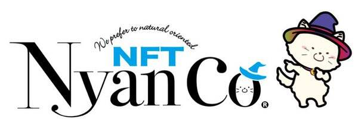

# NyanCo

涩谷区的猫。
它一直在那里，看着八公。此外，它还梦想着有一天它会上升到那个位置。
然而，它却在八公面前稍稍靠后的莫亚雕像周围徘徊了很多年。
在涩谷的莫亚雕像的反复试验中，它与一只路过的麻雀成为了朋友，
他们谈论了他们对未来的愿景。
在慢慢接近八公的途中，在深夜遇到老鼠，有时还被黑猫欺负，
但它的冒险仍在继续。
Moyai雕像和Hachiko之间的距离很近。
然而，对于小动物来说，这是一次大冒险。
当它终于到达它渴望看到的八公附近时，它发现他实际上是一尊铜像。
（它以为他还活着。）
在旅途中，它将与许多朋友相遇和团结，这将是一次
从涩谷到日本，再到世界更新时尚、文化和潮流的大冒险。
然后，我们启动了这个 NyanCo NFT 项目，希望 NyanCo像涩谷的八公一样，成为元界中每个人的聚会场所

什么是NyanCo？
NyanCo 是作为“网红猫”诞生于日本的手绘 NFT 系列。
忠犬“八公”是现实世界中涩谷东京的象征铜像，忠犬“NyanCo”是Web 3.0虚拟世界中涩谷东京的新象征。
现在，NyanCo 的各种变体将在 Web 3.0 世界中诞生！
就像 NyanCo 的主题猫一样，我们想要自由移动，跳出框框思考，继续创造我们喜欢的东西。
然后，我们也希望全世界的创作者都这样做。
让我们与充满激情的 NyanCo 团队一起，创造一个自由的世界，每个人都可以从日本涩谷的前沿潮流中“寻找并享受自己的品味”！

