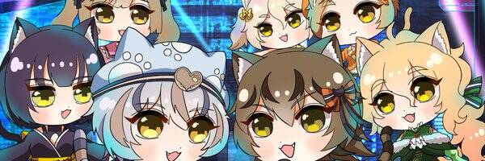

# NYAVATAR

NYAVATAR 是一个 AI Vtuber 的集合，他们看起来像一个人，但内心却是一只猫。

他们继承了真猫的外貌和性格，通过让AI学习SNS回复和直播评论，NYAVATAR将能够说人类的语言和歌曲，并以成为顶级歌手为目标。

每个 NYAVATAR 都有 1,111 个 NFT 作为主许可证，通过购买它们，他们将承认你是他们的主人之一，并特别在 SNS 和直播上回复你。

在学习人类语言和歌曲后，他们将开始一场音乐表演战，所以获得你最喜欢的 NYAVATAR 的 Master License 并为他们加油打气，因为他们会尽力不输给对手！

