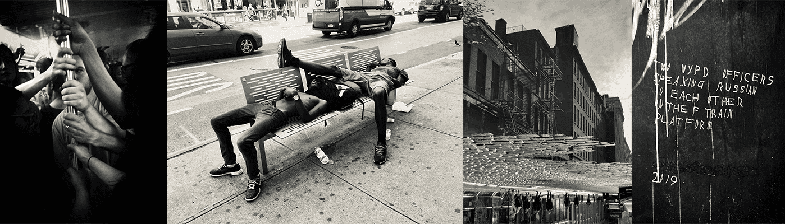

# nyc365 journey to the unexpected.

nyc365 不仅仅是一部纽约市的纪录片，它是对这座城市的美丽、对比、砂砾、光辉和节奏的奇幻视角，充满了超现实主义、抽象主义、印象主义、立体主义和现实主义——所有主要的艺术运动似乎都是由一位摄影师代表，是这座宏伟城市的一大摄影集。

nyc365 出人意料的旅程。NFT - 常见问题（FAQ）
▶ 什么是 nyc365 出人意料的旅程。？
nyc365 出人意料的旅程。是一个 NFT（不可替代代币）集合。存储在区块链上的数字艺术品集合。
▶ 多少 nyc365 的旅程出乎意料。代币存在吗？
总共有 364 次 nyc365 出人意料的旅程。NFT。目前，134 位车主至少有一次 nyc365 出人意料的旅程。NTF 在他们的钱包里。
▶ 什么是最昂贵的 nyc365 出人意料的旅程。销售？
最贵的 nyc365 出人意料的旅程。出售的 NFT 是 Emergence。它于 2022-06-20（2 个月前）以 109.8 美元的价格售出。
▶ 多少 nyc365 的旅程出乎意料。最近有卖吗？
有 1 次 nyc365 出人意料的旅程。过去 30 天内售出的 NFT。
▶ 什么是流行的 nyc365 出乎意料的旅程。备择方案？
许多拥有 nyc365 的用户的旅程出乎意料。NFT 还拥有 The Prologue。, 7 Atmospheres , RafoExtreme和 Frozen in Eternity。Liseykina 版本。

