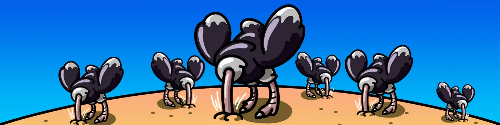

# Oblivious Ostriches

这组 4,892 只鸵鸟的头颅埋在沙子里，是一种免费薄荷糖，旨在在熊市期间让 NFT 人群振作起来（他们无法忍受看加密货币图表）。 当 ETH 恢复历史最高价（4,892 美元）时，每张图片的元数据都会更新，届时所有的鸵鸟都会从沙子中探出头来露出脸！遗忘的鸵鸟是一种神秘的精神错乱的动物，是 疯狂的心灵旅行者宇宙。 在 https://www.mindtravelernft.com 上查看它们！

Oblivious Ostriches NFT 在过去 7 天内售出 6 次。 Oblivious Otriches 的总销售额为 353.29 美元。 Oblivious Otriches NFT 的平均价格为 58.9 美元。 有 765 名 Oblivious Otriches 所有者，总共拥有 4,892 个代币。

什么是遗忘鸵鸟？
Oblivious Ostriches 是一个 NFT（非同质代币）集合。存储在区块链上的数字艺术品集合。
▶ 有多少 Oblivious Otriches 代币？
总共有 4,892 个 Oblivious Otriches NFT。目前，765 位所有者的钱包中至少有一个 Oblivious Ostriches NTF。
▶ 什么是最昂贵的遗忘鸵鸟销售？
最昂贵的 Oblivious Ostriches NFT 是 Oblivious Ostriches #170。它于 2022-06-28（大约 2 个月前）以 241.5 美元的价格售出。
▶ 最近卖出了多少只遗忘鸵鸟？
过去 30 天内售出了 38 个 Oblivious Ostriches NFT。
▶ 一只不经意的鸵鸟要多少钱？
在过去 30 天里，Oblivious Ostriches NFT 最便宜的销售额低于 1 美元，最高销售额超过 110 美元。 Oblivious Ostriches NFT 在过去 30 天内的中位价格为 1 美元。
▶ 什么是流行的 Oblivious Otriches 替代品？
许多拥有 Oblivious Ostriches NFT 的用户还拥有 Cupid Love Rose、Steampunk Creatures of the Deep、Eldermyths 和 KnuckleHeadz。

