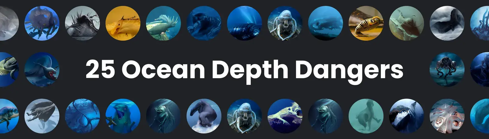

# Ocean Depth Dangers

这个集合中只有 4'000 个 NFT 图像这是来自深海深处的生物集合 另外 105 张图片将在第三天另外 110 张图片可用等...在第 25 天另外 220 张图片将可用所以，这个集合中总共只有 4'000 张 NFT 图像

什么是深海危险？
Ocean Depth Dangers 是一个 NFT（非同质代币）集合。存储在区块链上的数字艺术品集合。
▶ 存在多少 Ocean Depth Dangers 代币？
总共有 135 个 Ocean Depth Dangers NFT。目前，64 位车主的钱包中至少有一份 Ocean Depth Dangers NTF。
▶ Ocean Depth Dangers 最昂贵的促销活动是什么？
出售的最昂贵的 Ocean Depth Dangers NFT 是 Wodrash。它于 2022 年 6 月 21 日（2 个月前）以 23.1 美元的价格售出。
▶ 最近卖出了多少 Ocean Depth Dangers？
过去 30 天内共售出 165 个 Ocean Depth Dangers NFT。
▶ Ocean Depth Dangers 的费用是多少？
在过去 30 天里，Ocean Depth Dangers NFT 最便宜的销售额低于 22 美元，最高销售额超过 22 美元。过去 30 天，Ocean Depth Dangers NFT 的中位价格为 22 美元。
▶ 什么是流行的 Ocean Depth Dangers 替代品？
许多拥有 Ocean Depth Dangers NFT 的用户还拥有 Deep Ocean Dangers、Cross The Ages - Arkhante Premium Pack、Life Beyond Origin Collection。
 交互式 NFT 项目：Goofball Gang。立即购买。

