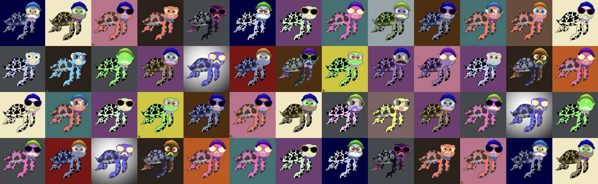

# Ocean-Project-Turtles

Ocean Project Turtles 是一个全新的集合，包含 10,000 个独特的 NFT，它们生活在 Polygon 区块链上 - No Gas。 每只海龟都是手绘的，由算法随机生成并 100% 归您所有。 它无法复制、带走或销毁。我们每周将赠送 3 个 nft。 上面有宝箱的海龟是最稀有的！ 规则是：您只需要持有一只或多只海龟，并且您必须喜欢、转发、评论 Twitter 上的每周抽奖。我们将记录此内容并发布每周，以便您看到获胜者。抽奖将开始 一旦我们售出 100 个 nft，每周一次。我们将每周赠送 - 1x 金胸龟 1x 银胸龟 1x 青铜胸龟我们 The Ocean Project 的主要目标是捐赠给帮助/帮助清洁海洋的慈善机构。 每个季度 The Ocean Project 将捐赠一定比例并在推特上发布收据作为证明。 加入我们的 twitter 或 discord 以获取更新。

