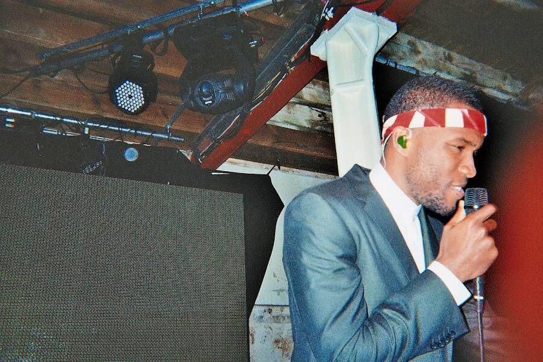

# Ocean's 11

Frank Ocean 于 2011 年 11 月 11 日在伦敦 XOYO 表演的一系列 33 张独特电影照片，以 11 组为一组发行。这是 Ocean 自他广受好评的混音带“nostalgia, ULTRA”发行以来的第二次现场表演。 该节目在纽约现场直播日期被取消之后，因此他的伦敦表演成为他有史以来的第一次欧洲现场表演。我作为一名 17 岁的学生使用假身份证进入该节目。 在最初的 15 英镑门票在创纪录的时间内售罄后，我在 eBay 上购买了 90 英镑的门票。 我带了一台柯达 35 毫米一次性胶卷相机来纪念这一时刻。 这些照片表达了 Ocean 低调的艺术性、音乐天赋、感染力的个性、全球人才、胆怯的焦虑和永恒的历史。 2021 年 8 月 22 日我的鲁格玛

