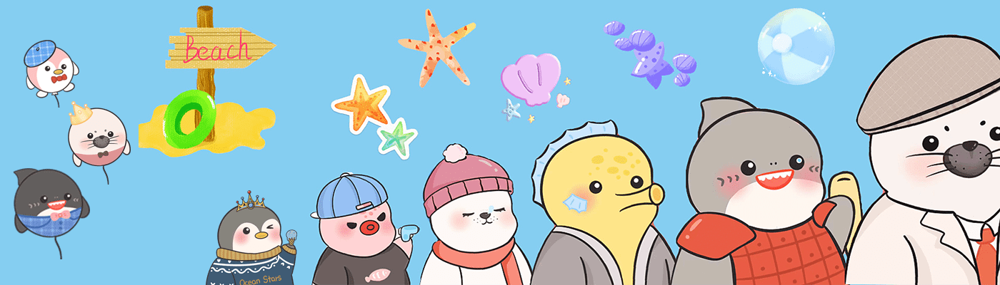

# OceanStarsClub

OceanStarsClub 拥有 10,000 只独特可爱的海洋动物，由 6 种海洋动物（海豹、鲨鱼、北极熊、章鱼和企鹅）组成，个个都酷毙了！ 我们有一个绝妙的游戏规则：6 种不同的动物可以升级为一张金票，您在收集时总能赢回 ETH！ 在我们的社区，我们还与海洋环境保护非政府组织合作。 做环保支持者，与海洋之星同行！

海洋之星由 6 种海洋动物（海豹、鲨鱼、北极胡须、章鱼和企鹅）组成。 Launch 总共将发布 10,000 个。 您可能还会发现一些非凡而稀有的东西。

我们为什么要创建这个 NFT 项目？ 首先，应该有一个对区块链感兴趣的艺术家更专属的社区/俱乐部，然后我们来了！ 此外，我们真的很担心海洋环境的恶化，所以所有的星星和我们的员工都会帮助 OCEANA (NGO) 保护海洋动物。 最后，我们将向 OCEANA 捐赠 20 eth。

Balloon Booming Plan：收集 6 种不同的动物进行组合将给您一张金票。 OceanStars官方将在opensea上以0.4 ETH购买金票。 你也不能错过那些气球！ 一个气球可以将金票的价格最大化到1.25倍（最高10倍）。

