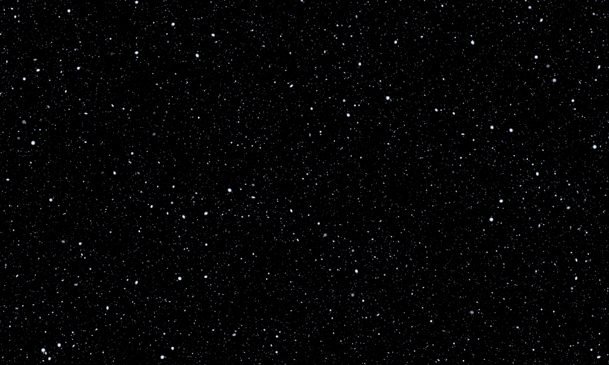

# OddAliens

加入我们的 DISCORD 频道 ddAliens 是一个独特的 NFT 集合，具有超过 200 个由算法生成的手绘特征，作为 ERC-721 NFT 存在于 matic 网络上。 每个外星人都有独特的属性，有些比其他的更罕见。 持有者可以参与NFT认领、抽奖、社区赠品等专属活动。外星人拥有BREED系统。 女性外星人（具有 200 多种特征）带着她们的卵来到地球殖民。 这些卵将在孵化 2 个月后孵化，并从中诞生第二代儿童外星人（具有不同的艺术）。 每个女性外星人都需要一个男性外星人来孵化她们的卵。 持有 1 男 1 女外国人 1 个月的人将拥有 1 个或更多的鸡蛋。 这些卵在孵化2个月后会孵化出来，并从中诞生第二代儿童外星人（具有不同的艺术）。外星人的所有版权归其所有者所有。

