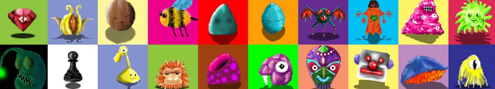

# OddBlobz

经过死亡自我
OddBlobz 有各种颜色、形状和大小。来自整个银河系的可收集的好奇生物。

什么是 OddBlobz？
OddBlobz 是一个 NFT（Non-fungible token）集合。 存储在区块链上的数字艺术品集合。
▶ 存在多少个 OddBlobz 代币？
总共有 104 个 OddBlobz NFT。 目前，47 位所有者的钱包中至少有一个 OddBlobz NTF。
▶ 最近卖出了多少 OddBlobz？
过去 30 天内售出 0 个 OddBlobz NFT。

网主。 0.13。 底价。 14.5。 成交量。 OddBlobz 有各种颜色、形状和尺寸。 来自整个银河系的可收藏的好奇生物。 grid_on 项目。 show_chart 活动。

