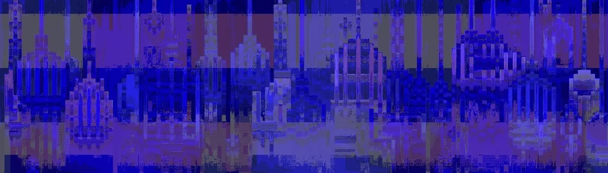

# OdditiesAI

薄荷活了！！ 前 2000 个免费，每个剩余 0.005 个！令人惊叹的 5555 个 AI 奇怪集合，揭示 7 月。 科技是未来，NFT 是艺术的未来！ 路线图？ 不和谐？ FCK 那个，我们要登月了！没有网站，没有 Discord。 仅限 Twitter 和 Etherscan！由 AI COLLECTIVE 创建

什么是 OdditiesAI？
OdditiesAI 是一个 NFT（不可替代代币）集合。 存储在区块链上的数字艺术品集合。
▶ 存在多少 OdditiesAI 代币？
总共有 1,445 个 OdditiesAI NFT。 目前 185 位所有者的钱包中至少有一个 OdditiesAI NTF。
▶ 最昂贵的 OdditiesAI 销售是什么？
最昂贵的 OdditiesAI NFT 是 Hidden Egg #1293。 它于 2022-06-24（2 个月前）以 5.5 美元的价格售出。
▶ 最近卖出了多少 OdditiesAI？
过去 30 天内售出了 9 个 OdditiesAI NFT。
  交互式 NFT 项目：Goofball Gang。 乙

