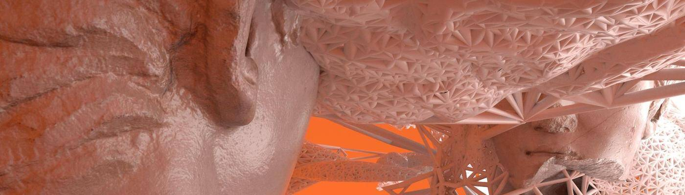

# Odyssey Genesis Collection

以四个 Genesis NFT 为基石，他们建立了一个广阔而开放的市场。 这将是一个庆祝文化、发现新艺术、以他们的货币 OHM 交易和实施新想法的平台。 在 Odyssey，我们意识到艺术创新和社区建设之间存在很强的交集。 重点规则是首先尊重社区的氛围，并尊重与这种氛围产生共鸣的艺术家，比如 Dimitri Daniloff。 我们空间的核心事实是，无论事物变得多么有趣，无论收藏变得多么有利可图，价值都来自社区。 我们只是观察这些作品融合在一起，但要归功于艺术家、策展人和收藏家的创作。 对于那些创造价值的人来说，市场应该是最健康的聚集点。 我们很高兴能为此试验下一代平台设计。

