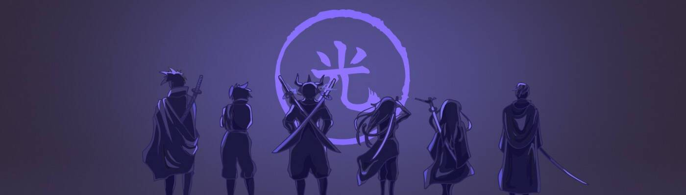

# Official Hikari

灵魂数量：2,566 初始数量：2,9989 - 截至 22 年 8 月 12 日光灵魂可以通过我们的交互式网络体验 Gen-U 转移到“初始”中。如何认领您的初始：1.找到一个灵魂并检查 它目前的 Gen-U 进展。 一些灵魂将等待揭晓，而另一些灵魂可能已经部分玩了 Gen-U：HERE2。带着你的灵魂穿越 Gen-U。 在游戏动作中确定您的氏族、性别和其他特征：HERE3.在美国东部标准时间凌晨 4 点之前提交您的 Gen-U 数据，并在 24 小时内公布！从 5,555 个灵魂开始，Hikari 是由 Jeez & ChainX.A 创建的“初始者”集合 灵魂的能量可以在 Gen-U 体验中被转移到一个启动者中并被提升。 由此产生的艺术是根据游戏内的决策数据生成的。持有者可以访问我们的 MOBA：Hikari 传奇中的未来收藏品、空投、漫画、街头服饰和可玩角色。欢迎来到不合时宜的家。

