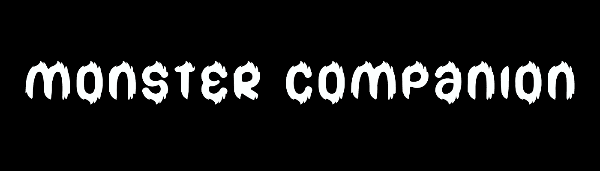

# Official Monster NFT

Monster Companion 是 4999 个怪物的独特集合，它们从以太坊区块链的一个神秘维度降落。它们的可爱绝对是它们如此受欢迎和可爱的原因，谁不喜欢毛球呢？ 收养怪物并不是那么容易。 他们既可爱又善良，但也很狂野！

什么是官方怪物 NFT？
官方 Monster NFT 是一个 NFT（Non-fungible token）集合。 存储在区块链上的数字艺术品集合。
▶ 官方 Monster NFT 代币有多少？
总共有 127 个官方 Monster NFT NFT。 目前 89 位所有者的钱包中至少有一个 Official Monster NFT NTF。
▶ 官方 Monster NFT 最近卖出了多少？
过去 30 天内共售出 0 个官方 Monster NFT NFT。

