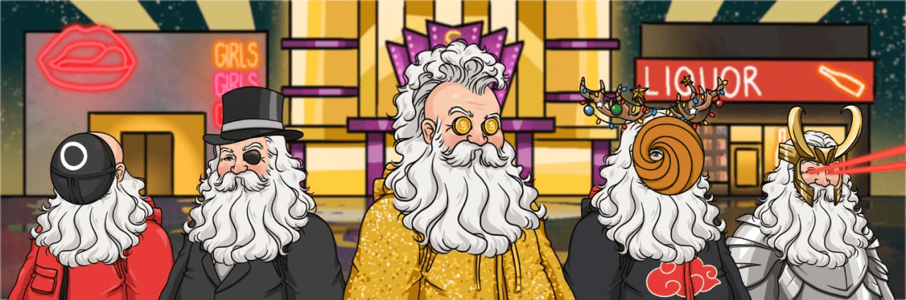

# Official Bad Santas

💰 每个 NFT 持有者都可以访问加密交易信号组！ （价值 1500 美元）💰🤯 在 2,222 个 NFT 中，其中 1 个是传奇的，这是整个系列中最稀有的作品，将赢得迈阿密之旅，拥有豪宅、游艇和名人🤯

什么是官方坏圣诞老人？
官方 Bad Santas 是一个 NFT（不可替代令牌）集合。 存储在区块链上的数字艺术品集合。
▶ 有多少官方 Bad Santas 代币？
总共有 79 个官方 Bad Santas NFT。 目前，42 位车主的钱包中至少有一个 Official Bad Santas NTF。
▶ 最近售出了多少个官方坏圣诞老人？
过去 30 天内售出 0 个官方 Bad Santas NFT。

