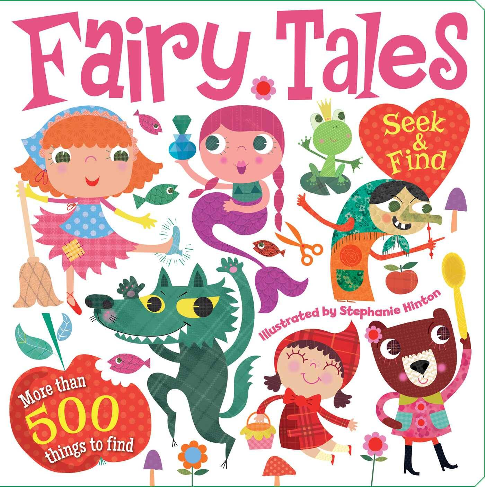

# Official Fairytales

Fairytales是一个项目，共有3733个代币，类似3只小猪，7个矮人，3个仙女教母，3个愿望，7个美人鱼姐妹。 这些代币由 Leon DeYun 制作，旨在成为适合所有年龄段的友好卡通。

什么是官方童话？
Official Fairytales 是一个 NFT（非同质代币）集合。存储在区块链上的数字艺术品集合。
▶ 官方童话代币有多少？
总共有 1,548 个官方童话 NFT。目前，222 位所有者的钱包中至少有一本官方童话 NTF。
▶ 最昂贵的官方童话故事拍卖会是什么？
出售的最昂贵的官方童话 NFT 是童话。它于 2022-06-23（2 个月前）以 9.7 美元的价格售出。
▶ 最近卖出了多少官方童话？
过去 30 天内售出了 11 个官方童话 NFT。
▶ 一部官方童话故事要多少钱？
过去 30 天，Fairytales 官方 NFT 最便宜的销售额低于 1 美元，最高销售额超过 10 美元。过去 30 天内，官方童话 NFT 的中位价格为 4 美元。
▶ 什么是流行的官方童话替代品？
许多拥有 Official Fairytales NFT 的用户还拥有 Deluxe AI Wives、MakeShitHappen、QTZ 和 meta_ghost_pass。

