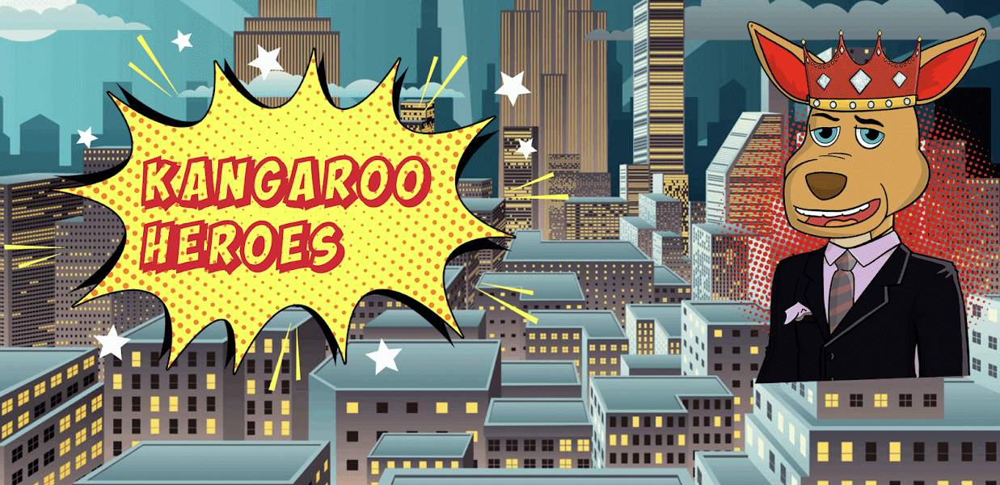

# Official Kangaroo Heroes

一个基于金融知识、投资教育、小企业成功和世代财富的 NFT 项目，装在袋鼠的袋子里。

Kangaroo Heroes 是 4,444 个 Kangaroo NFT 的集合，它们是独一无二的，并且存在于以太坊区块链上。 袋鼠英雄是基于我们公司税务和会计特许经营 Jumping Jack Taxes 的吉祥物。 随着 Jumping Jack Tax Brand 在全国范围内的发展，它将为我们的袋鼠英雄 NFT 项目创造更多曝光率。

您的袋鼠英雄授予您访问权限：

Kangaroo Con 的独家门票。 国内最大的金融 NFT 会议。 您只能以 NFT 持有者的身份参加会议。 我们不会向公众出售门票。 我们计划于 2022 年 12 月在宾夕法尼亚州费城举办本次会议。

稀有的超能力。 在已发布的 4,444 名袋鼠英雄中，共有 556 名英雄将拥有特定的超能力，其中包括参加有关如何投资加密货币的私人大师班、我们的年度黑色领带社交活动的有限门票，与创始人的集体视频通话 唐奈尔王子，免费空投袋鼠英雄金融漫画书作为 NTfs 和免费商品。

