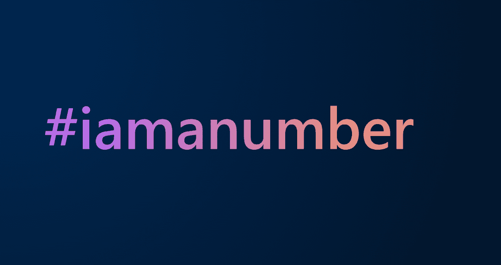

# OG Official

我们是朋克。 我们是猿猴。 我们是猫、狗、蟾蜍，甚至是他妈的泡菜。 我们只是在胡闹，但我们已经在塑造互联网的未来。非常感谢您与我一起在这个领域。TankNote OG 代币可以着色，但这些颜色适用于持有者的钱包并且不会 t 使用 OG 代币进行转账。 这些颜色来自另一个可以单独交易的 NFT 集合：OGColor。

OG 官方 NFT 在过去 7 天内售出 1 次。 OG Official 的总销售额为 3.84 美元。 一份 OG 官方 NFT 的平均价格为 3.8 美元。 OG 官方拥有者 1,822 名，总供应量为 9,999 枚。

