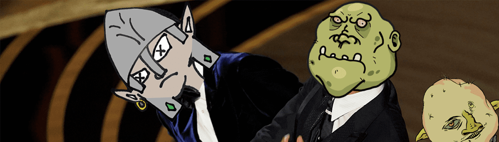

# Ogre town

欢迎来到食人魔镇，在这里我们与哥布林热身，并与所有愚蠢的精灵和人类战斗。

什么是食人魔城镇？
食人魔镇是一个 NFT（非同质代币）集合。 存储在区块链上的数字艺术品集合。
▶ 食人魔镇代币有多少？
总共有 5,555 个食人魔城镇 NFT。 目前，1,179 名所有者的钱包中至少有一个食人魔城镇 NTF。
▶ 食人魔镇最贵的交易是什么？
售出的最昂贵的食人魔镇 NFT 是食人魔镇 #358。 它于 2022-06-08（3 个月前）以 5.1 美元的价格售出。
▶ 最近卖出了多少食人魔城镇？
过去 30 天内售出 3 个 Ogre town NFT。
▶ 什么是受欢迎的食人魔镇替代品？
许多拥有 Ogre town NFT 的用户还拥有 Character Design Official、The Order of Alt Keks、Doodles By AI 和 Sugar (Genesis)。

