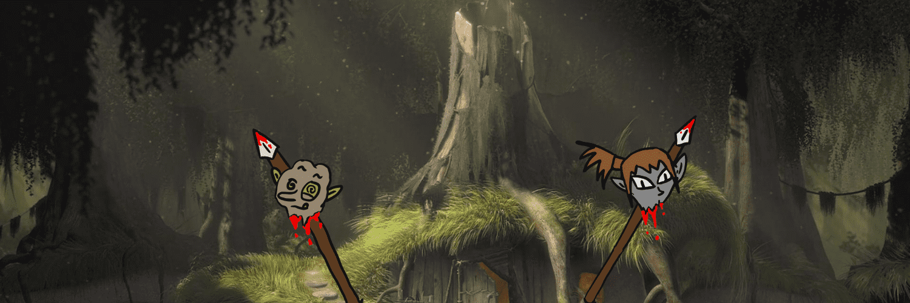

# Ogre town WTF (Free Mint 6969)

免费薄荷 6969 | 最多 10 个 NFT / 钱包 食人魔无法掌握语音。 ᵤGₕₐₐₐₕₐₐₐₐₐₐₐᵤGₕₕₐₐₐₐₐₐ GbLinS ₐᵤgₕₐₐₐₐₐₐₐGₐ ElVEs …

食人魔镇 WTF NFT - 常见问题（FAQ）
▶ 什么是食人魔城镇WTF？
Ogre town WTF 是一个 NFT（非同质化代币）集合。 存储在区块链上的数字艺术品集合。
▶ 食人魔镇WTF代币有多少？
总共有 6,967 个食人魔镇 WTF NFT。 目前，1,679 位所有者的钱包中至少有一个 Ogre town WTF NTF。
▶ 最近卖了多少食人魔镇WTF？
过去 30 天内售出 0 个 Ogre town WTF NFT。
▶ 什么是流行的食人魔镇 WTF 替代品？
许多拥有 Ogre town WTF NFT 的用户还拥有 EL NUMEROS、DegenOkayBears、WaterBe4nZuki 和 Old Legacy。

