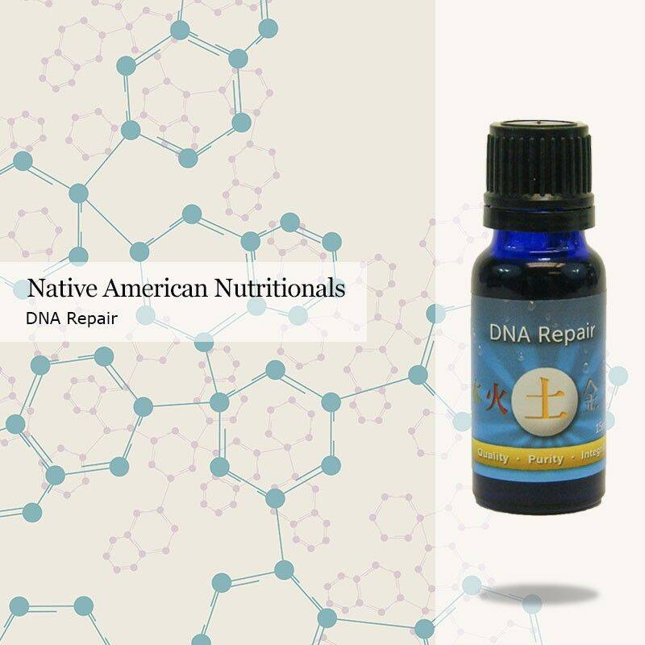

# OIL DNA COLLECTION

里面有油的人类 DNA。 智人沉迷于过时的能源。 气候变化在这里视觉：Vlad Dryamov 声音：Pixelord Idea：Ilya Tekhlikidi 标签：HHD 详细信息：bit.ly/oil_dna

Web内含油的人类DNA。 智人沉迷于过时的能源。 气候变化就在这里 视觉：Vlad Dryamov 声音：Pixelord 创意：Ilya Tekhlikidi 标签：HHD 详细信息：bit.ly/oil_dna

Web2021/03/12 · OIL DNA COLLECTION - Non-Fungible-Token | PlayToEarn 不可替代代币 Gordon Ramsay 将地狱厨房带入沙盒元宇宙……

特级初榨橄榄油经常被掺假，添加从橄榄以外的植物获得的油。DNA分析是鉴定油中植物成分的快速而经济的工具。在橄榄，碾磨种子和油中测试了通过PCR提取和扩增DNA，以研究其在橄榄油可追溯性中的用途。DNA是从榛子，玉米，向日葵，花生，芝麻，大豆，大米和南瓜制成的不同油中提取的。比较参比植物材料和油中的DNA熔化图谱，有可能鉴定油和油混合物中的任何植物成分。实时荧光定量PCR（RT-PCR）平台增加了高分辨率熔化（HRM）的新方法，两者都用于分析橄榄油与其他不同百分比的油混合。结果表明，HRM是一种有效检测橄榄油掺假的具有成本效益的方法。

