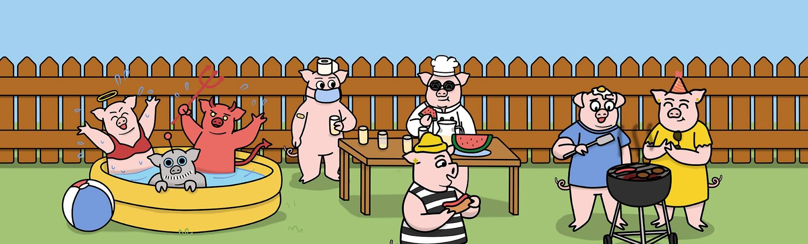

# Oink's Backyard BBQ

**为奥因克斯举办的后院烧烤！**

9，001个ERC-721 Oink将生成并存储在以太坊区块链上。每个Oink都是从200多种特征池中独特生成的，可作为后院烧烤的入场通行证！收集一两个Oink并参加烧烤，收集$OINK令牌并加入乐趣！

**Oinks正在下降@8月21日星期一，美国东部时间下午6：30！**

WebAbout the BBQ Oink's Backyard Barbecue 的想法是由 NFT 空间内的统一和社区的简单想法驱动的（除了作为涂料简介图片）。 我们的首要目标是开发一个社区专属平台，以有趣、互动、创意和竞争的方式向我们的会员支付报酬。

