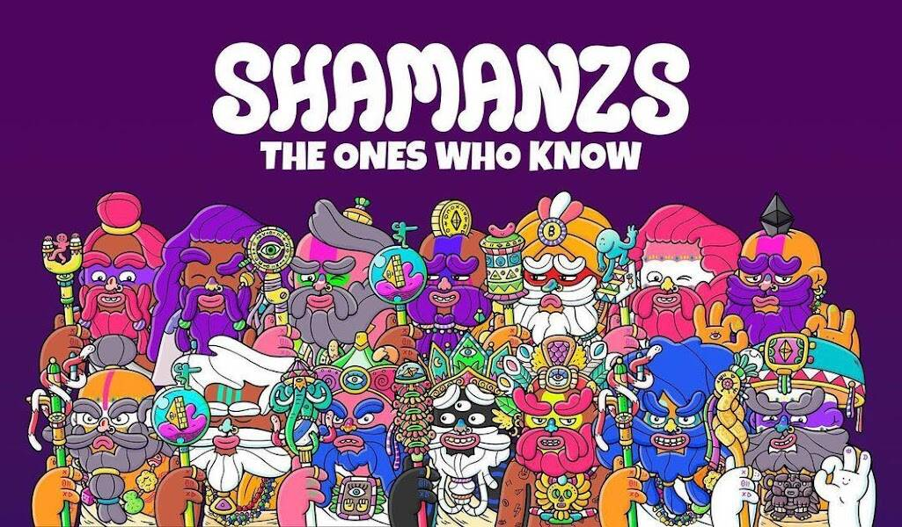

# Shamanzs NFT's

https://twitter.com/shamanzs 9898名萨满巫师开始了他们前往应许之地的旅程 - Shamaverse。@brosmind创造的独特艺术 // https://discord.gg/shamanzs

Shamanzs 是以太坊区块链上以编程方式随机生成的 9898 个 NFT 的原始集合。 数以百计的特征都是手绘的，以创造出大量高品质和独特的爱心角色。 所有 Shamanz 都遵循 ERC721 NFT 标准。

萨满兹是以太坊区块链上以编程方式和随机生成的9898个NFT的原始集合。数以百计的特征是手工绘制的，以创建大量高质量和独特的爱情角色。所有萨满兹都遵循ERC721 NFT标准。这意味着适应性和耐用性得到保证。该团队正在计划一项战略，以便在铸造阶段提供尽可能多的分销。每个NFT都将是您进入Shamaverse的秘密通行证，Shamaverse将结合数字和物理世界的实用工具。故事精神土地上最聪明的僧侣、撒督、戈兹和古鲁兹，无论他们属于哪个古老的宗教，都在秘密地联手打造一支强大的统一军团。他们的目标是传播爱和美好的共鸣，以一次从地球母亲身上抹去坏能量。一支新的萨满士大军正在秘密崛起，而有史以来最大的追随者群体，即将以无限的正能量照亮整个元宇宙。来自不同部落、信仰、宗教、背景和自然的领导人正在融合在一个进化和升级的版本中;自称萨满兹。萨满兹军团散发在世界各地的不可阻挡的积极浪潮，正在追赶休眠的古代神灵的注意，谁知道接下来会发生什么......

