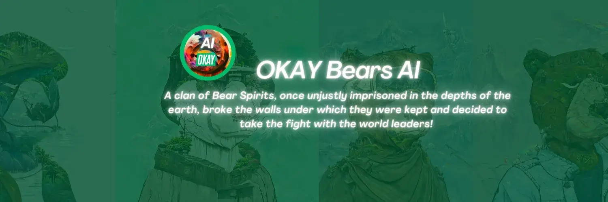

# Okay Bears AI

有一个神话...2亿年前！空气不接触土壤，雨水不给大地喂食，火无处不在，燃烧着生命的最后一块。

人们正在死去。妈妈们把最后一块面包送给孩子，而她们却慢慢死去。长老们的希望就在破烂中！

没有希望！唯一造成这种情况的人是世界上所有部落的领袖。他们创造了它......为了权力和财富。

直到有一天，一个熊魂氏族，曾经被不公正地囚禁在地球深处，打破了他们被关押的墙壁，决定与世界领导人作战！ 

他们将自己的灵魂与地球上的所有元素，空气，火，土和水融合在一起！他们踏上了复仇之旅！

