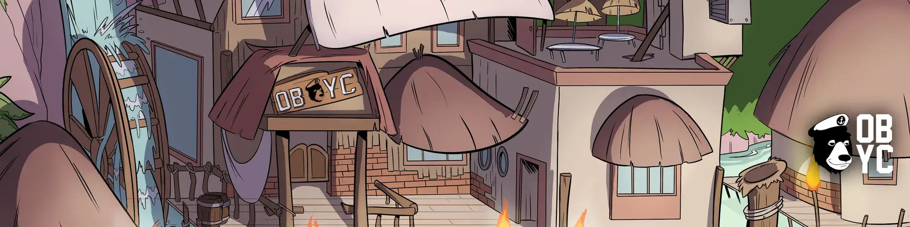

# Okay Goblins Yacht Club

由[OBYCLabs](https://opensea.io/zh-CN/OBYCLabs?tab=created)

Okay Bears Yacht Club是以太坊区块链中7，777个NFTS的集合，由150多个手绘和独特特征生成。您不仅拥有完整的知识产权，而且您的熊还可以充当数字收藏品和会员卡。由社区选出的一组成员领导，担任核心团队，版主和理事会。我们计划为我们的持有者带来创新，实用和利益。受到两个伟大项目的启发，我们很无聊，但我们没事。

官方不和谐：https://discord.gg/obyc 

官方推特：https://twitter.com/OkayBearsYC

##### ▶ 什么是好的哥布林？

Okay Goblins是一个NFT（不可替代的令牌）集合。存储在区块链上的数字艺术品的集合。

##### ▶ 有多少个好哥布林令牌存在？

总共有8，307个Ok Goblins NFT.目前有445个所有者在他们的钱包里至少有一个Ok Goblins NTF。

##### ▶ 最昂贵的好哥布林销售是什么？

最昂贵的Ok Goblins NFT卖的是[Ok Goblins](https://www.nft-stats.com/asset/0x551e96000c55d40f1eacdf19877d9b0b8bc47d5b/4059)。它于2022-06-11（2个月前）以1.3美元的价格出售。

##### ▶ 最近卖了多少个好哥布林？

在过去的2天内售出了30个Ok Goblins NFT。

##### ▶ 什么是流行的好哥布林替代品？

许多拥有 Okay Goblins NFT 的用户也拥有 [The Buildoors](https://www.nft-stats.com/collection/the-buildoors)、[Izit-a-Bear](https://www.nft-stats.com/collection/izit-a-bear)、[Okay Moonbirds Yacht Club](https://www.nft-stats.com/collection/okay-moonbirds-yacht-club) 和 [ApesOnChainCollection](https://www.nft-stats.com/collection/apesonchaincollection)。

