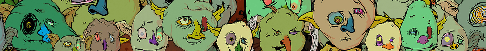

# Okay Goblins

Mint 已经上线（前 7k 免费，然后是 0.002ETH）10,000 个 Goblins 还可以。很快就会揭晓……

在过去的7天里，没有出售过好的哥布林。

[Mint是实时的](https://etherscan.io/address/0x551e96000c55d40f1eacdf19877d9b0b8bc47d5b#writeContract)（首先是7k免费，然后是0.002ETH）

10，000个哥布林刚刚好，很快就会透露...

##### 什么是好的哥布林？

Okay Goblins是一个NFT（不可替代的令牌）集合。存储在区块链上的数字艺术品的集合。

##### ▶ 有多少个好哥布林令牌存在？

总共有8，307个Ok Goblins NFT.目前有445个所有者在他们的钱包里至少有一个Ok Goblins NTF。

##### ▶ 最昂贵的好哥布林销售是什么？

最昂贵的Ok Goblins NFT卖的是[Ok Goblins](https://www.nft-stats.com/asset/0x551e96000c55d40f1eacdf19877d9b0b8bc47d5b/4059)。它于2022-06-11（2个月前）以1.3美元的价格出售。

##### ▶ 最近卖了多少个好哥布林？

在过去的30天内售出了2个Ok Goblins NFT。

##### ▶ 什么是流行的好哥布林替代品？

许多拥有 Okay Goblins NFT 的用户也拥有 [The Buildoors](https://www.nft-stats.com/collection/the-buildoors)、[Izit-a-Bear](https://www.nft-stats.com/collection/izit-a-bear)、[Okay Moonbirds Yacht Club](https://www.nft-stats.com/collection/okay-moonbirds-yacht-club) 和 [ApesOnChainCollection](https://www.nft-stats.com/collection/apesonchaincollection)。

