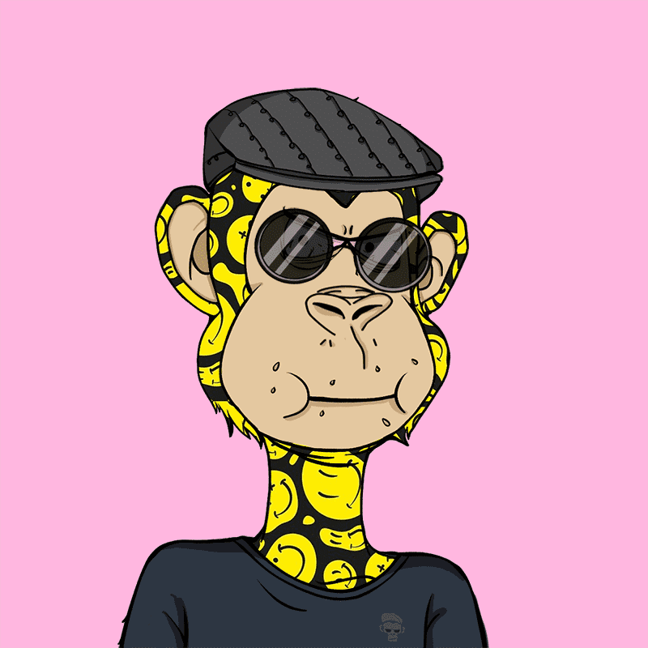

# Okay Joyful Ape Yacht Club V2

经过
78DDFC
OJAC 是一个快乐猿 nfts 的集合，一个生活在以太坊区块链上的独特数字集合。

Okay Joyful Ape Yacht Club V2 NFT在过去7天内售出36次。Okay Joyful Ape Yacht Club V2的总销量为55.59美元。一艘 Okay Joyful Ape Yacht Club V2 NFT 的平均价格为 1.5 美元。有1，886 Okay Joyful Ape Yacht Club V2所有者，总共拥有5，555个代币。

##### 什么是好快乐猿游艇俱乐部V2？

Okay Joyful Ape Yacht Club V2是NFT（不可替代令牌）的集合。存储在区块链上的数字艺术品的集合。

##### ▶ 有多少 Okay Joyful Ape Yacht Club V2 代币存在？

总共有5，555个Ok Joyful Ape Yacht Club V2 NFT.目前有1，886个车主在他们的钱包里至少有一个Oky Joyful Ape Yacht Club V2 NTF。

##### ▶ 最昂贵的 Okay Joyful Ape Yacht Club V2 销售是什么？

最昂贵的 Okay Joyful Ape Yacht Club V2 NFT 售出的是 [Okay Joyful Ape Yacht Club #4348](https://www.nft-stats.com/asset/0x754854d0ee6a6a15a4010672ab489be2ec967f21/4348)。它在2022-07-04（约2个月前）以7.6美元的价格出售。

##### ▶ 最近卖了多少架 Okay Joyful Ape Yacht Club V2？

在过去的30天内，有37架Ok Joyful Ape Yacht Club V2 NFT售出。

##### ▶ 一艘 Okay Joyful Ape Yacht Club V2 要花多少钱？

在过去的30天里，最便宜的 Okay Joyful Ape Yacht Club V2 NFT 销量低于 1 美元，最高销量超过 3 美元。Okay Joyful Ape Yacht Club V2 NFT的中位價格在過去30天是1美元。

