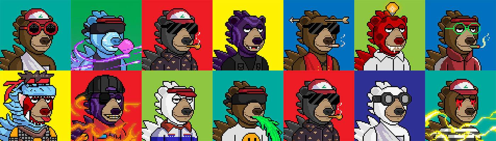

# Okay Kaiju Bears

好的，Kaiju Bears来到你附近的城市！一个社区驱动的CC0项目，拥有你的NFT和附着在它上面的艺术品。

在过去的7天里，没有卖掉怪物熊俱乐部（Okay Kaiju Bears）。

怪物熊俱乐部（原好海珠熊）来到你附近的城市！一个社区驱动的CC0项目，拥有你的NFT和附着在它上面的艺术品。脱销！

##### 什么是怪物熊俱乐部（Okay Kaiju Bears）？

Monster Bear Club（Okay Kaiju Bears）是NFT（不可替代令牌）的集合。存储在区块链上的数字艺术品的集合。

##### ▶ 有多少怪物熊俱乐部（Okay Kaiju Bears）代币存在？

总共有5，000个怪物熊俱乐部（Okay Kaiju Bears）的NFT.目前有1，541个所有者在他们的钱包里至少有一个怪物熊俱乐部（Okay Kaiju Bears）NTF。

##### ▶ 最昂贵的怪物熊俱乐部（Okay Kaiju Bears）销售是什么？

NFT出售的最昂贵的怪物熊俱乐部（Okay Kaiju Bears）是[Ok Kaiju Bear #721](https://www.nft-stats.com/asset/0xe5b30a6525beee36781c221e0d8aa5a7aa4b9add/721)。它在2022-06-14（2个月前）以1.2美元的价格出售。

##### ▶ 最近卖了多少只怪物熊俱乐部（Okay Kaiju Bears）？

在过去的30天内，有6个怪物熊俱乐部（Okay Kaiju Bears）的NFT售出。

##### ▶ 什么是流行的怪物熊俱乐部（Okay Kaiju Bears）替代品？

许多拥有Monster Bear Club（Okay Kaiju Bears）NFT的用户还拥有[Okay Duck Yacht Club](https://www.nft-stats.com/collection/okayduckyachtclub)，[Moon Goons Official](https://www.nft-stats.com/collection/moon-goons-official)，[Apes of the Caribbean](https://www.nft-stats.com/collection/apesofthecaribbean)和[Ethereum Monkey Business（EMB）。](https://www.nft-stats.com/collection/ethereum-monkey-business-v2)

