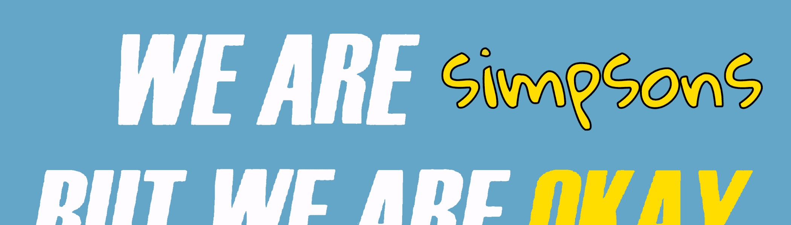

# Okay Simpsons Yacht Club

我们很无聊，但我们没事，辛普斯。好的辛普森游艇俱乐部是一个文化转变。一个由3，333个不同的辛普森一家组成的小型干净集合，建立了一个超越互联网进入现实世界的良性社区。生活在以太坊区块链上。灵感来自 Okay Bears、 BAYC & Simpsons。5分钟内售罄

##### 什么是好的辛普森游艇俱乐部？

Okay Simpsons Yacht Club是NFT（不可替代令牌）的集合。存储在区块链上的数字艺术品的集合。

##### ▶ 有多少Okay Simpsons Yacht Club代币存在？

总共有3，333个Ok Simpsons Yacht Club NFT.目前有361个所有者在他们的钱包里至少有一个Okes Simpsons Yacht Club NTF。

##### ▶ 最昂贵的好辛普森游艇俱乐部销售是什么？

最昂贵的Okay Simpsons Yacht Club NFT售出的是[Okay Simpsons Yacht Club #911](https://www.nft-stats.com/asset/0xc4e6bbc6d8ce292bd9642774e23c266c83a3ac8f/911)。它在2022-06-23（2个月前）以7.5美元的价格出售。

##### ▶ 最近卖了多少个Ok Simpsons游艇俱乐部？

在过去的30天内，有2个Ok Simpsons Yacht Club NFT售出。

##### ▶ 什么是受欢迎的好辛普森游艇俱乐部替代品？

许多拥有Oky Simpsons Yacht Club NFT的用户也拥有[ElvesFckGoblins](https://www.nft-stats.com/collection/elvesfckgoblins)，[Kings of Ethereum](https://www.nft-stats.com/collection/kings-of-ethereum)，[Jewel Cases](https://www.nft-stats.com/collection/jewel-cases)和[The Profit Panthers](https://www.nft-stats.com/collection/the-profit-panthers)。

