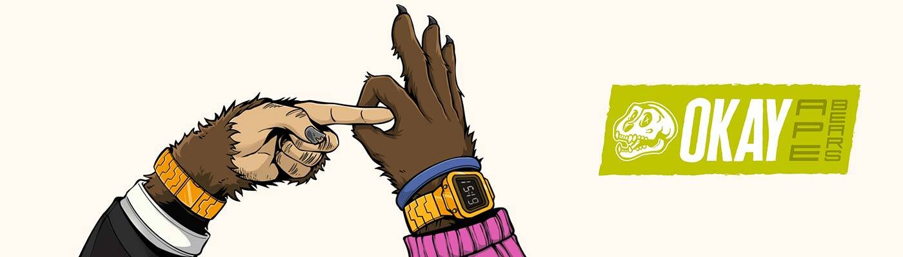

# Okay Ape Bears

在猿和熊碰撞的多元宇宙中。他们很无聊，然后他们交配，结果还好。

不隶属于BAYC或Oky Bears。

##### 什么是好猿熊？

Okay Ape Bears是NFT（不可替代令牌）集合。存储在区块链上的数字艺术品的集合。

##### ▶ 有多少 Okay Ape Bears 代币存在？

总共有2，071个Ok Ape Bears NFT.目前有710个所有者在他们的钱包里至少有一个Ok Ape Bears NTF。

##### ▶ 最昂贵的好猿熊销售是什么？

最昂贵的Ok Ape Bears NFT出售的是[Ok Ape Bear #1906](https://www.nft-stats.com/asset/0xb256a4b86c2124155068899806f665b5862fcbf8/1906)。它在2022-06-18（2个月前）以2.2美元的价格出售。

##### ▶ 最近卖了多少只好猿熊？

在过去的30天内售出了1个Ok Ape Bears NFT。

##### ▶ 什么是流行的 Okay Ape Bears 替代品？

许多拥有Ok Ape Bears NFT的用户还拥有[Bored Apes Punk Club](https://www.nft-stats.com/collection/boredpunkclub)，[Saisei Genesis](https://www.nft-stats.com/collection/saiseigenesis)，[Pugz Not Drugz](https://www.nft-stats.com/collection/pugz-not-drugz)和[3D Bored Punks Club](https://www.nft-stats.com/collection/3d-bored-punks-club)。

