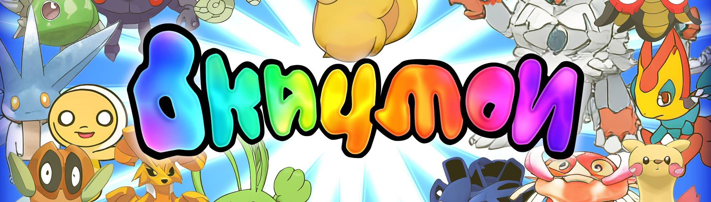

# Okayball

Okayballs是用于在以太坊区块链上捕捉Wild Okaymon的高级设备。访问 [https://okaymon.ai](https://okaymon.ai/) 薄荷。必须至少铸造其中之一！

##### ▶ 什么是Okball？

Okayball是一个NFT（不可替代令牌）集合。存储在区块链上的数字艺术品的集合。

##### ▶ 有多少个Okball代币存在？

总共有5个Okball NFT.目前有38个所有者在他们的钱包中至少有一个Okairball NTF。

##### ▶ 最昂贵的Okayball销售是什么？

出售的最昂贵的Okayball NFT是[Okairball（Gen 1）。](https://www.nft-stats.com/asset/0x195095b30b87ee6a94494f4bf662f5f9dc8119f9/0)它在 2022-06-07 （3 月 前） 以 $54.4 的价格出售。

##### ▶ 最近卖了多少Okayball？

在过去的30天内售出了1个Okairball NFT。

