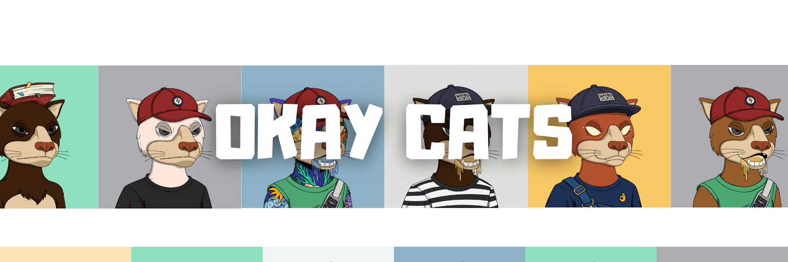

# Okay Cats Official

5564只猫生活在以太坊主网上，只是没关系。灵感来自 Okay Bears。

刷新元数据！

#####  什么是好猫官方？

Okay Cats Official 是一个 NFT（不可替代令牌）集合。存储在区块链上的数字艺术品的集合。

##### ▶ 有多少 Okay Cats 官方令牌存在？

总共有5，564个Ok Cats官方NFT.目前有346个所有者在他们的钱包中至少有一个Oky Cats Official NTF。

##### ▶ 什么是最昂贵的好猫官方销售？

最昂贵的Ok Cats官方NFT出售的是[Ok Cats #4216](https://www.nft-stats.com/asset/0x5a3de466982b010476579ad26d5a47db351055d7/4216)。它于2022-06-26（约2个月前）以1000美元的价格出售。

##### ▶ 最近卖了多少好猫官方？

在过去的30天内，有5个Ok Cats官方NFT售出。

##### ▶ 什么是流行的好猫官方替代品？

许多拥有Ok Cats官方NFT的用户也拥有[Aidea](https://www.nft-stats.com/collection/aideanft)，[FantasyAlien](https://www.nft-stats.com/collection/fantasticalien)，[Crypto Lowriders](https://www.nft-stats.com/collection/crypto-lowriders)和[SPACE SMASHERS](https://www.nft-stats.com/collection/spacesmashers)。

