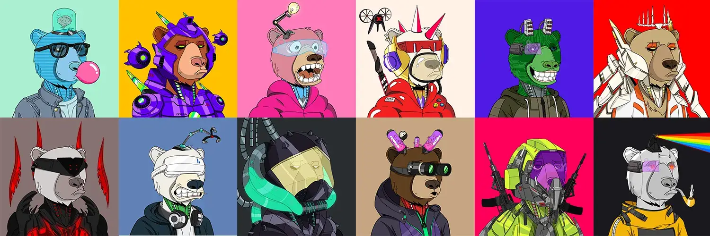

# Okay Cyber Bears

3，333网络熊准备发射。一个反乌托邦的未来，每个人都得到了REKT，只有熊生存。与任何其他项目没有隶属关系。

##### 什么是好的网络熊？

Okay Cyber Bears是NFT（不可替代令牌）集合。存储在区块链上的数字艺术品的集合。

##### ▶ 有多少 Okay Cyber Bears 代币存在？

总共有487个Oky Cyber Bears NFT.目前有339个所有者在他们的钱包中至少有一个Oky Cyber Bears NTF。

##### ▶ 什么是最昂贵的 Okay Cyber Bears 销售？

最昂贵的 Okay Cyber Bears NFT 售出的是 [Okay Cyber Bears #129](https://www.nft-stats.com/asset/0x831a53c54e9ff9bb3ff730aab86234b7b5b0438d/129)。它于2022-06-26（约2个月前）以16.5美元的价格出售。

##### ▶ 最近卖了多少个 Okay Cyber Bears？

在过去的30天内，有2个Ok Cyber Bears NFT售出。

