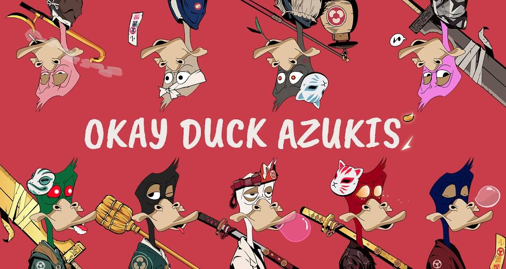

# Okay Duck Azukis

红豆不会游泳，但我们可以，我们没关系

##### 什么是好鸭子Azukis？

Okay Duck Azukis是NFT（不可替代令牌）集合。存储在区块链上的数字艺术品的集合。

##### ▶ 有多少Okay Duck Azukis代币存在？

总共有2，889个Oky Duck Azukis NFT.目前有395个所有者在他们的钱包里至少有一个Okish Duck Azukis NTF。

##### ▶ 最昂贵的Okay Duck Azukis销售是什么？

最昂贵的 Okay Duck Azukis NFT 售出的是 [OkayDuckAzukis #2236](https://www.nft-stats.com/asset/0x9343d7a00ff910bf97c074eb839c431989d23e62/2236)。它于2022-06-22（2个月前）以2.2美元的价格出售。

##### ▶ 最近卖了多少只好鸭子Azukis？

在过去的30天内售出了1个Ok Duck Azukis NFT。

##### ▶ 什么是流行的 Okay Duck Azukis 替代品？

许多拥有 Okay Duck Azukis NFT 的用户也拥有 [Okay Red Pandas](https://www.nft-stats.com/collection/okay-red-pandas)、[OrczTown.wtf](https://www.nft-stats.com/collection/orcztown-wtf)、[Blockchain Workers](https://www.nft-stats.com/collection/blockchain-workers) 和 [Hazai's Editions](https://www.nft-stats.com/collection/hazai-s-editions)。

