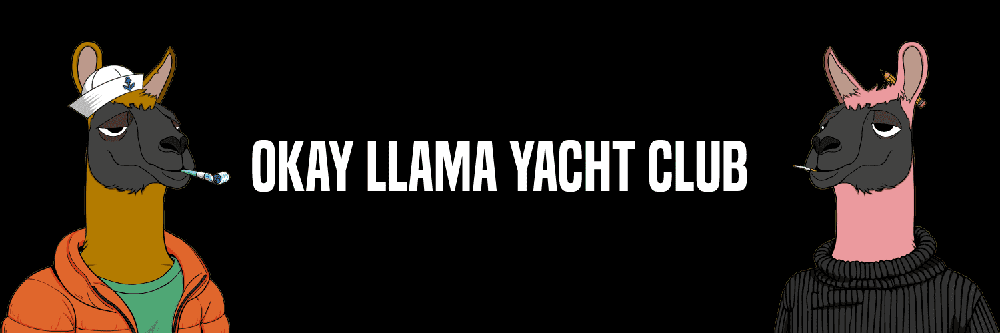

# Okay Llama Yacht Club

5,555 好的 Llama 游艇俱乐部。 Ptui 我们是美洲驼，我们很好

在过去的7天里，没有出售Okay Llama Yacht Club。

5，555 Okay Llama Yacht Club.*普图伊*我们是骆驼，我们没事

#####  什么是欧凯骆驼游艇俱乐部？

Okay Llama Yacht Club是NFT（不可替代令牌）的集合。存储在区块链上的数字艺术品的集合。

##### ▶ 有多少Okay Llama Yacht Club代币存在？

总共有3，714个Okay Llama Yacht Club NFT.目前有1，075名船东在他们的钱包里至少有一个Okay Llama Yacht Club NTF。

##### ▶ 什么是最昂贵的欧凯骆驼游艇俱乐部销售？

出售的最昂贵的 Okay Llama Yacht Club NFT 是 [OKay Llama Yacht Club #736](https://www.nft-stats.com/asset/0x0384a76489db13b93f1042271adc17df06549135/736)。它在2022-06-20（2个月前）以$ 8.7的价格出售。

##### ▶ 最近卖了多少架欧凯骆驼游艇俱乐部？

在过去的30天内，有18架Okay Llama Yacht Club NFT售出。

##### ▶ 欧凯美洲驼游艇俱乐部的费用是多少？

在过去的30天里，最便宜的Okay Llama Yacht Club NFT销售额低于1美元，最高销售额超过7美元。Okay Llama Yacht Club NFT的中位价格是过去30天的1美元。

##### ▶ 什么是受欢迎的欧凯骆驼游艇俱乐部替代品？

许多拥有 Okay Llama Yacht Club NFT 的用户还拥有 [Okay Papa Moon Azuki Bears Yacht Club](https://www.nft-stats.com/collection/papaokaybears)、[The Rabbit Fence](https://www.nft-stats.com/collection/the-rabbit-fence)、[The Ninja Hideout](https://www.nft-stats.com/collection/theninjahideout) 和 [trollcave.wtf](https://www.nft-stats.com/collection/trollcavewtf)。

