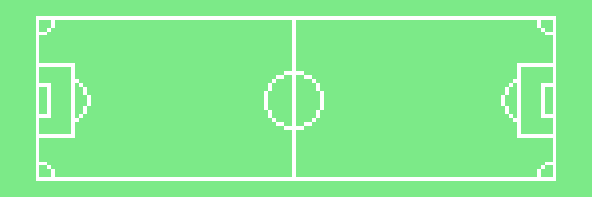

# OmniPlayer

Omniplayer 系列是 1k Free Mint 像素艺术足球运动员，是所有兼容 EVM 链中最大的足球运动员 nft 系列。 社区为社区的项目！

OmniPlayer NFT - 常见问题（FAQ）

▶ 什么是 OmniPlayer？

OmniPlayer 是一个 NFT（不可替代令牌）集合。存储在区块链上的数字艺术品集合。

▶ 存在多少 OmniPlayer 代币？

总共有 388 个 OmniPlayer NFT。目前，219 位所有者的钱包中至少有一个 OmniPlayer NTF。

▶ 最昂贵的 OmniPlayer 销售是什么？

最昂贵的 OmniPlayer NFT 是 [Omniplayer #24](https://www.nft-stats.com/asset/0x4ffeb3bab6fed0b4c19e6c9c67608acec06ded6b/24)。它于 2022-06-09（3 个月前）以 14.4 美元的价格售出。

▶ 最近卖出了多少台 OmniPlayer？

过去 30 天内售出了 1 个 OmniPlayer NFT。

