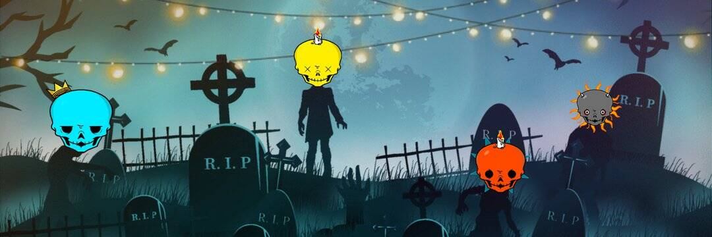

# OmniSkulls (ETH)

跨越不同区块链的 5555 个时尚头骨

你好骷髅，希望你们都有一个骷髅派对💀💀👻

我们正在处理我们管道的下一步。 请继续关注并打开🔔

感谢您对我们的支持。

我们所有的连锁店都卖光了，如果你觉得被遗忘了，不用担心。 ETH 铸币厂仍在 https://etherscan.io/token/0x28061801f6e1a0f98c04d1dacd8c3897b88080f7#writeContract

OmniSkulls (ETH) NFT - 常见问题 (FAQ)

▶ 什么是 OmniSkulls (ETH)？

OmniSkulls (ETH) 是一个 NFT（不可替代令牌）集合。存储在区块链上的数字艺术品集合。

▶ 存在多少个 OmniSkulls (ETH) 代币？

总共有 257 个 OmniSkulls (ETH) NFT。目前，40 位所有者的钱包中至少有一个 OmniSkulls (ETH) NTF。

▶ 最近卖出了多少 OmniSkulls (ETH)？

过去 30 天内售出 0 个 OmniSkulls (ETH) NFT。

