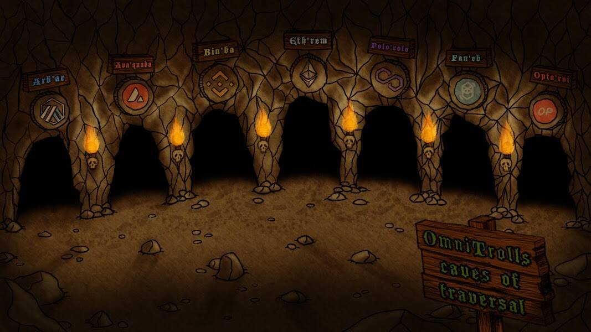

# OmniTrolls (polygon)

OmniTrolls 是生活在 OmniChain 或其他任何东西上的 6,666 个不断发展的巨魔的集合。当您将 OmniTrolls 遍历到所有 7 条链时，我猜它们会从糟糕的像素艺术 PFP 演变为杰作。这些是 OmniChain 上第一个不断发展的 NFT，开辟了新天地 和类似的东西。 是的。哦，还有一件事：他们可以自由铸造，我们现在随时都会宣布隐形掉落。 好的，你看完了吗？ 留下反应，离开这里，已经。

OmniTrolls（多边形）NFT - 常见问题（FAQ）

▶ 什么是 OmniTrolls（多边形）？

OmniTrolls（多边形）是一个 NFT（非同质代币）集合。存储在区块链上的数字艺术品集合。

▶ 存在多少个 OmniTrolls（多边形）代币？

总共有 1,376 个 OmniTrolls（多边形）NFT。目前 702 位所有者的钱包中至少有一个 OmniTrolls（多边形）NTF。

▶ 最昂贵的 OmniTrolls（多边形）销售是什么？

出售的最昂贵的 OmniTrolls（多边形）NFT 是 [OmniTrolls #2211 - Saca'raina（1 级）](https://www.nft-stats.com/asset/0x1e81806caec5458507ffdb67854d4ee4a42dfea9/2211)。它于 2022-06-06（3 个月前）以 4.4 美元的价格售出。

▶ 最近售出了多少 OmniTrolls（多边形）？

过去 30 天内售出了 1 个 OmniTrolls（多边形）NFT。

