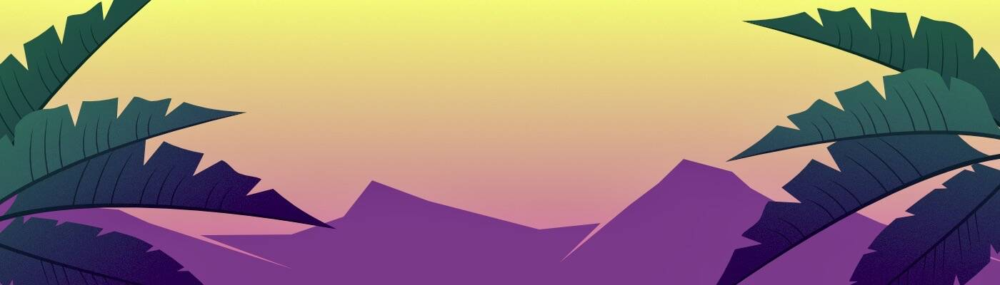

# OnChain Banana

3,333 根有机香蕉完全上链生产。 水果具有令人兴奋的各种特征和稀有性，包括年龄、糖点和颜色。我们的香蕉是使用生成方法实时绘制的。 不知道最终结果会是什么，它肯定会给您的餐桌带来惊喜。 OnChainBananas 让生活充满乐趣和健康！

OnChain Banan NFT - 常见问题（FAQ）

▶ 什么是OnChain Banan？

OnChain Banan Club 是一个 NFT（非同质代币）集合。存储在区块链上的数字艺术品集合。

▶OnChain Banan Club 代币有多少？

总共有 4,115 个 OnChain Banan Club NFT。目前，1,007 位车主的钱包中至少有一个 OnChain BananClub NTF。

▶ 最昂贵的OnChain Banan Club 销售是什么？

最昂贵的 OnChain BananClub NFT 是 [Apevolution Club #2520](https://www.nft-stats.com/asset/0xff35d2aaa7e7c5e3ad0d81d7e621086c642ab74d/2520)。它于 2022-06-23（2 个月前）以 54.9 美元的价格售出。

▶ OnChain Banan最近卖了多少？

过去 30 天内共售出 2 个 Apevolution Club NFT。

