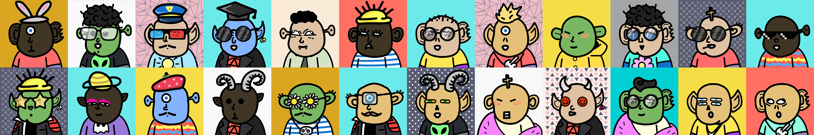

# One Day Bastards

最新的 ODB 游戏 NFT 在这里：https://onedaybae.io/collections/mekabae 薄荷是活的混蛋是多用途游戏资产：控制大篷车加速生产和资源开采管理城市参加活动每个混蛋每天获得 16500 美元 ODB 硬币一天混蛋是一个出色的合作 2D 风格的不同艺术家的集合。 从零开始到最后一场比赛——总有一天！ 哇？ 是的，他妈的一天。 不眠之夜，400 多个特征，欢乐，乐趣和一些啤酒。 弗伦斯，请查看我们的 Freaks 收藏品，该收藏品包含 10k 个字符并基于以太坊网络。 你拿不到钱！ 因为它完全免费（汽油除外😉）

一日混蛋 NFT - 常见问题 (FAQ)

▶ 什么是一日混蛋？

One Day Bastards 是一个 NFT（不可替代令牌）集合。存储在区块链上的数字艺术品集合。

▶ 有多少 One Day Bastards 代币？

总共有 10,000 个 One Day Bastards NFT。目前，1,491 位所有者的钱包中至少有一个 One Day Bastards NTF。

▶ 最近卖出了多少一日混蛋？

过去 30 天内售出了 0 个 One Day Bastards NFT。

https://www.goofballgang.com/?utm_source=ban6)

