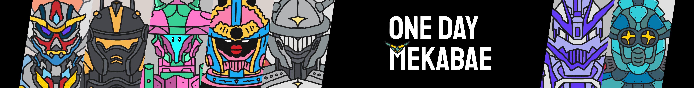

# One Day Mekabae

https://onedaybae.io/collections/mekabae MINT IS LIVEMekabae 是玩家手中最有价值的资产：探索新领域。 这是唯一可以进行该地区探索以获得它的单位！控制大篷车保护领土参加活动每个 Mekabae 每天获得 24750 $ODB 硬币一天 Mekabae - 来自 ODB 团队的 2D 风格的多彩多样机器人 - 15 人合作 艺术家。 超过 500 个特征和 15 个独特的 Mekabaes！Discord：https://discord.gg/6BQVWNyXE4 网站：https://onedaybae.io

One Day Mekabae NFT - 常见问题（FAQ）

▶ 什么是一日梅卡贝？

One Day Mekabae 是一个 NFT（非同质代币）集合。存储在区块链上的数字艺术品集合。

▶ 有多少 One Day Mekabae 代币？

总共有 5,096 个 One Day Mekabae NFT。目前，2,733 名所有者的钱包中至少有一个 One Day Mekabae NTF。

▶ 最近卖出了多少 One Day Mekabae？

过去 30 天内售出了 3 个 One Day Mekabae NFT。

▶ 有哪些流行的 One Day Mekabae 替代品？

许多拥有 One Day Mekabae NFT 的用户还拥有 [One Day Bastards](https://www.nft-stats.com/collection/one-day-bastards)、 [One Day Mint Pass](https://www.nft-stats.com/collection/one-day-mint-pass)、 [DoNotMintThis](https://www.nft-stats.com/collection/donotmintthis)和 [Old Legacy](https://www.nft-stats.com/collection/old-legacy)。

