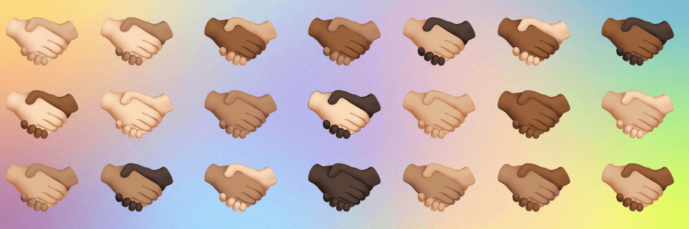

# One Hand Cleans The Other - $MATIC

🤝全链 nft | 1k 创世纪握手 | 不稀罕，人人平等 | 没有路线图或不和谐，只有共鸣。🤝ETHER -- https://etherscan.io/address/0x0dea7e8b0b38d20b2807d657e121430fd55789b0 BSC -- https://bscscan.com/address/0x0dEa7e8b0b38D20b2807d657E121430fD55789b0 MATIC。 optimistic.etherscan.io/address/0x0dEa7e8b0b38D20b2807d657E121430fD55789b0

一只手清洁另一只手 - $MATIC NFT - 常见问题（FAQ）

▶ 什么是一只手清洁另一只手 - $MATIC？

一只手清洁另一只手 - $MATIC 是一个 NFT（非同质代币）集合。存储在区块链上的数字艺术品集合。

▶ 有多少单手清洁另一手 - $MATIC 代币？

总共有 202 个 One Hand Cleans The Other - $MATIC NFT。目前，85 位业主的钱包中至少有一个 One Hand Cleans The Other - $MATIC NTF。

▶ 最近卖出了多少 One Hand Cleans The Other - $MATIC？

过去 30 天内售出了 0 个 One Hand Cleans The Other - $MATIC NFT。

