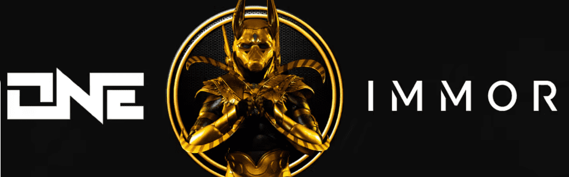

# One Immortl Gods

每个 One Immortl God NFT 都带有一系列统计数据，可在即将推出的真人快打风格游戏中使用。 使用此令牌作为您进入 One Immortl Arena 的门票，您将在其中与其他所有者对峙以获得一系列奖品。

One Immortl God NFT - 常见问题（FAQ）

▶ 什么是 One Immortl God？

ZEUS D2 是一个 NFT（不可替代代币）集合。存储在区块链上的数字艺术品集合。

▶ 有多少 One Immortl God代币？

总共有 2 个 One Immortl God NFT。目前 1 位所有者的钱包中至少有一个 ZEUS D2 NTF。

▶ 最近卖出了多少 One Immortl God？

过去 30 天内售出 0 个 One Immortl God NFT。

 

