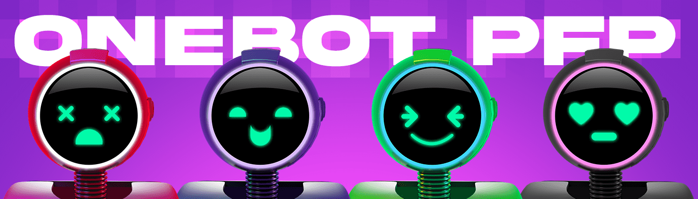

# OneBot

您的电子竞技和游戏虚拟世界的数字伴侣。 OneBot Genesis 系列包含 6,000 个独特的机器人化身，每个化身均由未来主义材料、发光的霓虹灯和展示其个性的动画表情构成。 每个 OneBot 都有自己的自定义实用程序，可增强 Esports Metaverse 中的功能和外观。

OneBot NFT - 常见问题（FAQ）

▶ 什么是 OneBot？

OneBot 是一个 NFT（不可替代令牌）集合。存储在区块链上的数字艺术品集合。

▶ 存在多少个 OneBot 代币？

总共有 2,227 个 OneBot NFT。目前，831 位所有者的钱包中至少有一个 OneBot NTF。

▶ 最昂贵的 OneBot 销售是什么？

售出的最昂贵的 OneBot NFT 是 [OneBot #2183](https://www.nft-stats.com/asset/0xe5a28e29a5e683e79535bd25057f6e0d59e080aa/2183)。它于 2022 年 6 月 11 日（2 个月前）以 24.1 美元的价格售出。

▶ 最近卖出了多少个 OneBot？

过去 30 天内售出了 1 个 OneBot NFT。

▶ 流行的 OneBot 替代品有哪些？

许多拥有 OneBot NFT 的用户还拥有 [Esports Arenas](https://www.nft-stats.com/collection/esports-arenas)、 [Metapass Genesis](https://www.nft-stats.com/collection/metapass-genesis)、 [notBanksyEchoes Polygon](https://www.nft-stats.com/collection/notbanksyechoespolygon)和 [The SquidGame Punks](https://www.nft-stats.com/collection/thesquidgamepunks)。

