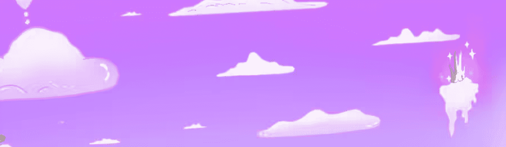

# OneOnes Curated Artist

第 1 部分：记住 LavaaGang 的游乐场 - 第 2 部分：Nopkarian 的 Grumm

OneOnes Curated Artist NFT 在过去 7 天内售出 1 次。OneOnes Curated Artist 的总销售额为 4.5 美元。一位 OneOnes Curated Artist NFT 的平均价格为 4.5 美元。有 650 个 OneOnes 策展艺术家所有者，拥有 1 个代币的总供应量。

OneOnes 策展艺术家 NFT - 常见问题（FAQ）

▶ 什么是 OneOnes 策展艺术家？

OneOnes Curated Artist 是一个 NFT（不可替代令牌）集合。存储在区块链上的数字艺术品集合。

▶ 存在多少个 OneOnes 策展艺术家代币？

总共有 1 个 OneOnes 策展艺术家 NFT。目前，650 位所有者的钱包中至少有一个 OneOnes 策展艺术家 NTF。

▶ 最昂贵的 OneOnes 策展艺术家拍卖会是什么？

OneOnes Curated Artist NFT 售出的最昂贵的商品是 [“Remember the Playground”](https://www.nft-stats.com/asset/0xb9f7de883e11db888cbecd9292d5942695d1ae70/0)。它于 2022 年 6 月 25 日（2 个月前）以 5.5 美元的价格售出。

▶ 最近卖出了多少 OneOnes 策展艺术家？

过去 30 天内售出了 2 个 OneOnes Curated Artist NFT。

