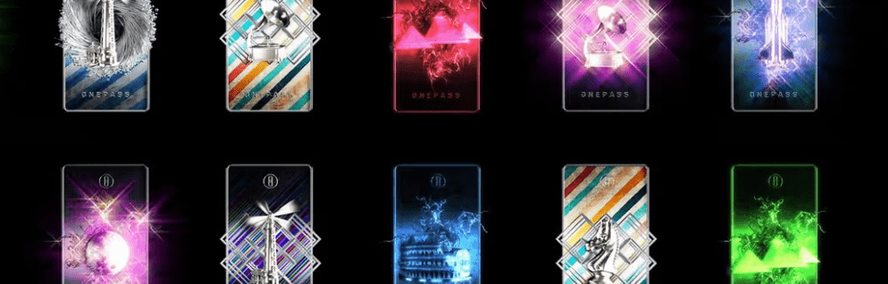

# OnePass MATIC

OneOf OnePass 是 2,600 个生成艺术 NFT 的集合，是您通往音乐、体育和生活方式 NFT 下降的令人兴奋的福利和特权世界的钥匙。 OnePass 的持有者将享受每年推出的免费 NFT，以及独家访问预售、IRL 和虚拟体验、折扣、赠品等。

OneOf OnePass NFT 的 Time Machines 在过去 7 天内售出 19 次。OneOf OnePass的 Time Machines 总销售额为 1.07 万美元。OneOf OnePass NFT 的一台 Time Machines 的平均价格为 56.1 美元。OneOf OnePass 的所有者拥有 420 台时间机器，总共拥有 1,422 个代币。

