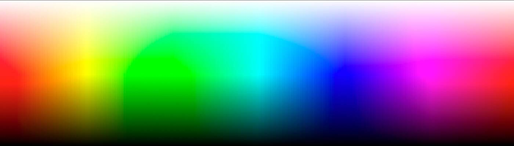

# One Shape One Color

世界上最简单的 NFT。 一种形状。 一种颜色。 阅读 https://mixart.io/one 上的故事，这是一个拥有 100% 吹牛权利的社会实验。 我们敢于让您拥有一种颜色的形状，并帮助提升地板，以便您可以告诉您的朋友“这不仅仅是 JPG，它是一种颜色形状的 f#king JPG”。

一种形状一种颜色 NFT - 常见问题 (FAQ)

▶ 什么是一种形状一种颜色？

一种形状一种颜色是一个 NFT（不可替代令牌）集合。存储在区块链上的数字艺术品集合。

▶ 存在多少个“一种形状一种颜色”令牌？

总共有 1,256 个一种形状一种颜色的 NFT。目前，337 位车主的钱包中至少有一个 One Shape One Color NTF。

▶ 最近卖出了多少同形同色？

过去 30 天内共售出 0 个同形同色 NFT。

