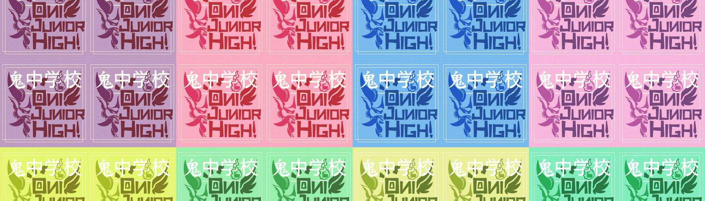

# Oni Jr High

3333 名 Oni 学生的创世纪集合。 另一个学期从元节开始……

Oni Jr High NFT - 常见问题（FAQ）

▶ 什么是小鬼高中？

Oni Jr High 是一个 NFT（不可替代代币）集合。存储在区块链上的数字艺术品集合。

▶ 有多少 Oni Jr High 代币？

总共有 464 个 Oni Jr High NFT。目前，95 位车主的钱包中至少有一个 Oni Jr High NTF。

▶ 最近卖出了多少个 Oni Jr High？

过去 30 天内售出 0 个 Oni Jr High NFT。

▶ 什么是流行的 Oni Jr High 替代品？

许多拥有 Oni Jr High NFT 的用户还拥有 [OmniTrolls (eth)](https://www.nft-stats.com/collection/omnitrolls-v2)、 [Omni Pharaohz](https://www.nft-stats.com/collection/omni-pharaohz)、 [Anti Moe Moe Club](https://www.nft-stats.com/collection/antimoemoeclub)和 [Founder Capsules](https://www.nft-stats.com/collection/founder-capsules)。

